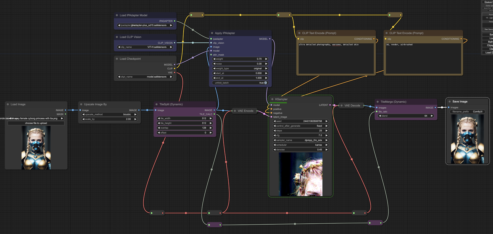

# SimpleTiles
## DynamicTileSplit / DynamicTileMerge

Splits image into tiles. Overlap value decides how much overlap there is between tiles on y axis, x axis is calculated to have the same ratio to image height as y axis.

Automatically splits image into tiles based on image size and tile size. Tiles can be different ratio than images.

DynamicTileSplit outputs a `tile_calc` object. The object contains info about size and overlap and should be passed to DynamicTileMerge.

**Overlap** value decides how much overlap there is between tiles on y axis, x axis is calculated to have the same ratio to image height as y axis. Should be set to same value as used in TileSplit.

**Blend** value decides how many pixels the blending is done over. Should be less than overlap value. Blending is done linearly from 0 to 1 over the blend distance.

## Legacy
DynamicTileSplit and DynamicTileMerge are the new versions of TileSplit and TileMerge. They are more flexible and easier to use.

Legacy nodes don't work well if image ratio and tile ratio is different. 

Use TileCalc to calculate the final image size, pipe the final size to TileMerge and ImageScale.

### TileSplit (Legacy)
Splits image into tiles. Overlap value decides how much overlap there is between tiles on y axis, x axis is calculated to have the same ratio to image height as y axis.

### TileMerge (Legacy)
Merge tiles into image. 

**Overlap** value decides how much overlap there is between tiles on y axis, x axis is calculated to have the same ratio to image height as y axis. Should be set to same value as used in TileSplit.

**Blend** value decides how many pixels the blending is done over. Should be less than overlap value. Blending is done linearly from 0 to 1 over the blend distance.

### TileCalc (Legacy)

Util to calculate final image size based on tile sizes and overlaps. 

## Example Ipadapter

